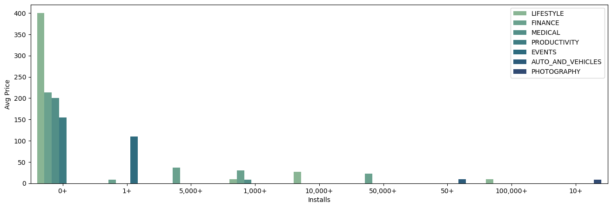
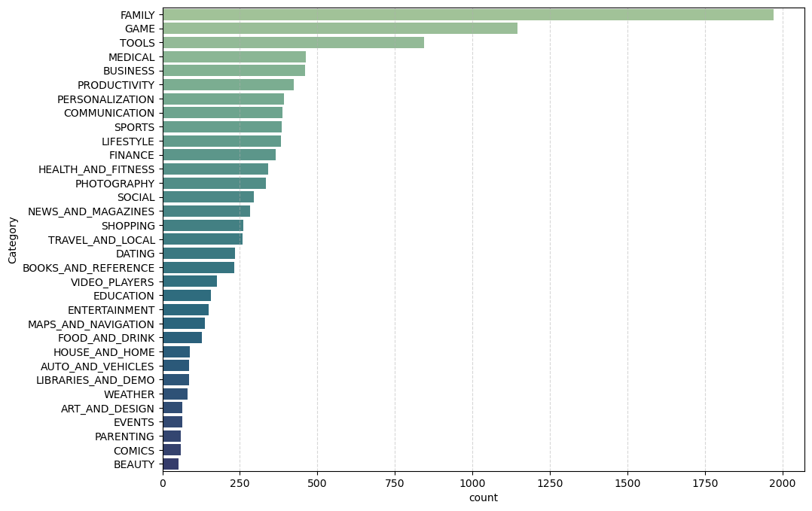
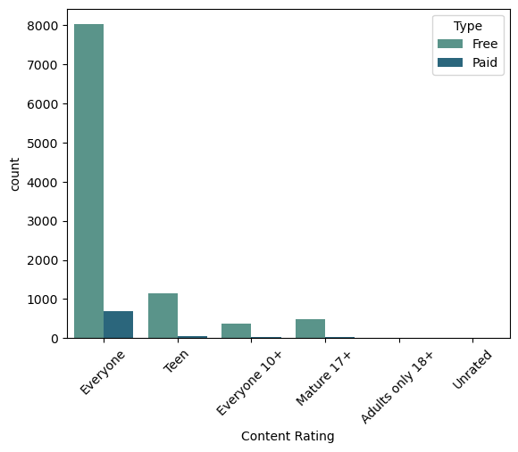
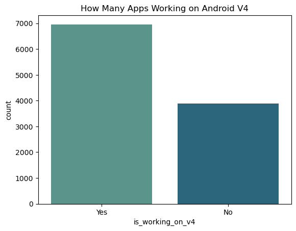
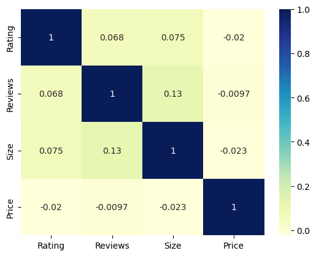
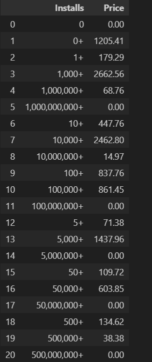
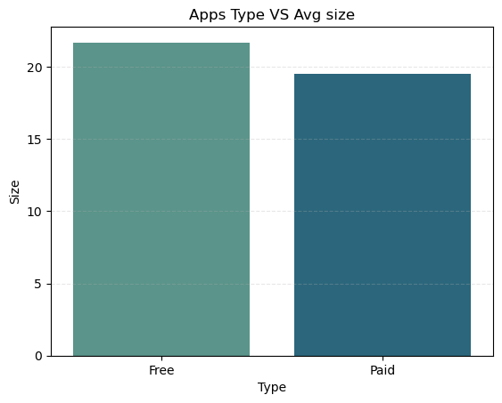
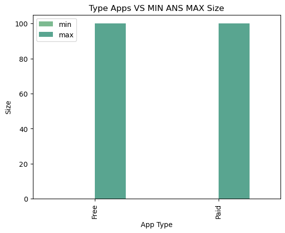

# **Strategic-Analysis-of-the-Google-Play-Store-Market**

## Background:

The mobile app market is highly competitive, with millions of apps vrying for users' attention. Developers and companies need to understand market trends, pricing strategies, user preferences, and competitive dynamics to succeed. This project leverages data scraped from the Google Play Store, focusing on 10,000 apps to analyze various aspects of the Android app market.

## Objective:

The primary goal of this project is to derive actionable business insights from the analysis of Google Play Store data. By understanding the app market dynamics, we can help app developers, marketers, and business leaders make informed decisions that align with market trends and consumer preferences.

### **Key Business Questions Addressed:**

####  **Pricing Strategy**

1. **What is the most expensive app on the store?**
 
    The highest-priced app is `I'm Rich - Trump Edition` from  `life Style` Category.

2. **What is the average price of apps for each genre with different install numbers?**

    

    Categories such as Lifestyle, Finance, Medical, and Productivity show high average prices in the lower install brackets (0+ and 1+ installs). This indicates that apps in these categories might be priced higher even if they don't attract a large number of installs, possibly due to their specialized or niche nature.

3. **How many apps have a rating > 4.7, and what is their average price?**

    The number of apps have rating more than 4.7 is `595` app and the avg price of them is `$0.5018487394957983`

----------------------------------------------------------------------------------------------------

#### **Market Segmentation**

4. **Which Genre has more apps?**

    

    **So `Family Category` has more apps on the google play store** 

    Apps from `Family Category` are saturated markets and potential areas

5. **How many apps are available for each Type and content rating?**

    

    The majority of apps, both free and paid, fall under the "Everyone" content rating. This suggests that most apps are designed to be accessible and appropriate for all age groups, likely to reach the broadest possible audience.

6. **How many apps work on Android version 4?**

    

    So there are `6961` Apps are working on Android V4

------------------------------------------------------------------------------------------------------
#### **User Engagement & App Performance**

7. **How many apps have more than 50K reviews?**

    **The number of apps that has more than 50k reviews is `2782` app.**

8. **Is there a correlation between rating, reviews, size, and the price of the app?**

    

    Observation: 
    These feature are not correlated with the price as we see

9. **How much did Google earn from apps with over 5,000,000 installs?**

    

    the apps with high number of installation can be free apps. so google don't earn from them 

---------------------------------------------------------------------------------------------------------

#### **Product Development**

10. **What is the average size of free vs. paid apps?**

    

    **The avg size for `Free` apps is `21.675505`, and for `Paid` is `19.516453`**

11. **What are the max and min sizes for free and paid apps?**

    

    Observation:
    - The minmum size for free & paid type is almost zero 
    - The maximum size for free & paid type is 100 MB

12. **What are the top 5 most expensive apps with a 5-star rating?**
    The 5 top expenisve apps that has rate of 5 are :
    - Ap art history flashcards
    - Usmle step 2 ck flashcards
    - Hey aj! it's bedtime!
    - Mestudying: ap english lit
    - Ti-84 ce graphing calculator manual ti 84

## Conclusion:
This analysis provides a comprehensive understanding of the Google Play Store landscape, offering insights into pricing, market saturation, user engagement, and app performance. These insights empower stakeholders to make strategic decisions regarding app development, marketing, and pricing, ultimately leading to better market positioning and revenue growth. The findings can also guide future app launches, updates, and marketing campaigns, ensuring they are aligned with market realities and user expectations.